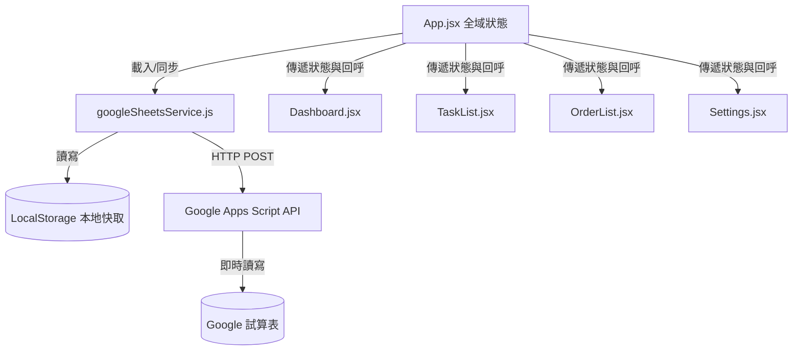

# 門市訂貨承諾與日常店務管理系統 - 系統設計說明書 (DESIGN.md)

本文件詳細記錄「門市訂貨承諾與日常店務管理系統」的前端架構、資料流程、Google Sheets (GAS) 同步協定、使用者角色權限、以及關鍵功能模組的設計規格。

---

## 📌 1. 系統概述

本系統是為連鎖門市設計的 **行動端優先 (Mobile-First) 響應式網頁系統**。旨在幫助門市人員管理每日日常職責任務、記錄執行狀況（需拍照/輸入金額防呆），並即時追蹤客戶的訂貨承諾與時效。

*   **前端技術棧**：React (v18.2) + Vite (v6.0) + Tailwind CSS + Lucide React 圖示庫。
*   **後端與儲存**：Google Sheets (試算表) 作為雲端資料庫，透過 Google Apps Script (GAS) 部署為 Web App 提供 API 接口；本地端使用 LocalStorage 進行離線暫存與防呆快取。

---

## 📐 2. 系統架構與元件設計

系統採用單頁面應用程式 (SPA) 架構，所有核心功能由底部導航欄進行切換：

### 📂 檔案目錄結構

```text
門市管理任務/
├── google-apps-script.js       # Google Apps Script 雲端指令碼範本
├── index.html                  # 網頁主入口
├── DEPLOY_GUIDE.md             # Cloudflare Pages 部署指南
├── DESIGN.md                   # 系統設計說明書 (本文件)
└── src/
    ├── main.jsx                # React 掛載點
    ├── index.css               # 全域 CSS (包含根字體放大 12.5% 設定)
    ├── App.jsx                 # 系統核心邏輯與全域狀態管理
    ├── mockData.js             # 門市清單、初始訂單、日常職責任務範本
    ├── services/
    │   └── googleSheetsService.js # 雲端 API 溝通與本地 LocalStorage 快取服務
    └── components/
        ├── BottomNav.jsx       # 底部導航欄
        ├── Dashboard.jsx       # 首頁統計儀表板
        ├── TaskList.jsx        # 日常店務任務 (含拍照與金額回報 Modal)
        ├── OrderList.jsx       # 訂單追蹤清單 (含狀態變更 Action Sheet)
        ├── OrderForm.jsx       # 新增訂單表單 (含電子簽名功能)
        ├── CustomerList.jsx    # 客戶管理清單
        └── Modal.jsx           # 共用警告對話框
```

### 🔄 全域狀態流轉關係



---

## 🔒 3. 使用者角色與權限矩陣 (RBAC)

系統內置四個角色層級，嚴格限制門市跨店敏感資料的存取權限：

| 角色 (Role) | 預設帳號/密碼 | 職責與資料查看範圍 | 關鍵操作權限 |
| :--- | :--- | :--- | :--- |
| **超級管理員**<br>`SUPER_ADMIN` | `wenhe` / (免密) | **全分店**所有訂單、任務與設定。 | 可執行所有功能、直接取消已完成任務。 |
| **總管理處稽核員**<br>`AUDITOR` | `admin` / `8888` | **全分店**所有訂單與任務；用於總部稽核。 | 查看照片與金額、管理帳號，**無法**新增訂單。 |
| **分店店長**<br>`STORE_MANAGER` | `yiyu` / (免密) | **僅限所屬分店**的所有訂單與店員任務。 | 修改所屬分店訂單狀態、管理分店自檢。 |
| **一般銷售人員**<br>`STAFF` | `yiting` / (免密) | **僅限自己建立**的訂單、自己分店的任務。 | 僅可新增/修改自己提單的訂單狀態、完成自檢。 |

---

## 📝 4. 日常店務任務模組 (TaskList)

將傳統繁瑣的店務重構為符合門市實際運作的 **5 大核心工作職責**，並導入回報防呆機制。

### 📋 5 大每日職責定義
1.  **開店-儀容自檢 (個人項目)**：格式為 `開店-儀容自檢 (姓名)`。系統會根據使用者名單動態維護此任務，非管理員的上班人員皆需各自執行。
2.  **開店-環境清掃 (共用項目)**：分店同仁有人執行即可。
3.  **營業-零用金確認 (共用項目)**：需確認櫃台零用金是否相符。
4.  **營業-隨機盤點庫存 (共用項目)**：每日抽盤店內高單價手機或周邊。
5.  **閉店-庫存表上傳 (共用項目)**：閉店前匯出 POS 庫存表並回報。

### 📸 拍照與金額回報防呆流程 (抗崩潰設計)
*   **強制要求**：
    *   儀容自檢、環境清掃、隨機盤點任務必須啟動手機相機拍照並上傳（以 Base64 格式編碼），否則無法提交。
    *   零用金確認任務必須輸入「實際盤點金額 (元)」，否則無法提交。
*   **防崩潰 (Anti-Crash) 設計**：
    在 Webview 或舊版瀏覽器中，重複觸發 `<label>` 與 `<input type="file">` 容易造成事件冒泡引發 React 白畫面。系統改用純裝飾型 `button` 並綁定 `onClick` 手動觸發 hidden input，並呼叫 `e.stopPropagation()` 與 `e.preventDefault()` 徹底隔絕冒泡。

---

## 📦 5. 訂單追蹤與 8 大業務標籤模組 (OrderList)

為使訂單生命週期更貼合通訊門市的業務情境，系統將訂單狀態篩選重構為 **8 大標籤頁籤**：

### 🏷️ 8 大標籤篩選邏輯與業務用意
1.  **全部 (ALL)**：權限範圍內的所有訂單。
2.  **📋 訂貨需求 (REQ)**：
    *   *用意*：客戶已在店內落訂建單，等待採購人員下單。
    *   *邏輯*：`status === '訂貨需求'`。
3.  **📦 已下訂 (ORDERED)**：
    *   *用意*：已向總部或廠商訂貨，物流配送中。
    *   *邏輯*：`status === '已下訂'`。
4.  **🟢 已到貨 (ARRIVED)**：
    *   *用意*：商品已送達分店並點收完成，等候客戶來店取件（且未逾期）。
    *   *邏輯*：`status === '已到貨'` 且預計交貨日未過。
5.  **🔵 已交單 (DELIVERED)**：
    *   *用意*：客戶已到店驗機、完成手寫電子簽名，順利交貨歸檔。
    *   *邏輯*：`status === '已交單'` 或 `status === '已交機'`。
6.  **⏰ 即將到期 (DUE_SOON)**：
    *   *用意*：提醒店員此訂單之預計交貨日快到了（例如在 2 天內），需緊急催貨或通知。
    *   *邏輯*：非已交單，且剩餘天數 $\ge 0$ 且 $\le$ 警示天數 (預設 2 天)。
7.  **🚨 逾期訂單 (OVERDUE_ORDER)**：
    *   *用意*：**最嚴重的警示！** 預計交期已過，但我們卻「連貨都還沒收到」（貨物仍卡在訂貨需求或已下訂），需立刻向採購或廠商催貨。
    *   *邏輯*：交期已過，且狀態為 `訂貨需求` 或 `已下訂`。
8.  **⚠️ 逾期取件 (OVERDUE_CLAIM)**：
    *   *用意*：貨已經到店，交期也過了，但「客戶一直沒來拿」，需門市人員主動撥打電話催取。
    *   *邏輯*：`status === '已到貨'` 且交期已過。
9.  **🛑 逾期交單 (OVERDUE_HANDOVER)**：
    *   *用意*：所有過了預計交貨日卻「尚未完成交易」的項目（包含「貨還沒來」與「客還沒取」）。
    *   *邏輯*：交期已過，且非已交單狀態。

### 🔄 訂單狀態快速變更面板 (Action Sheet)
*   若使用者具備修改權限，訂單卡片右下角會出現 **「🔄 變更訂單狀態」**。
*   點選後從網頁下方滑出 Action Sheet，變更狀態後，前端將透過 `updateOrderStatus` 呼叫 API，利用 **SyncAll (全量覆寫)** 協定一次性同步回 Google Sheets，簡化後端 Apps Script 的開發負擔，並保障資料一致性。

---

## 📡 6. 資料庫與 API 同步協定 (GAS)

為了達成高容錯與極簡部署，系統採用 **全量覆寫同步 (SyncAll)** 作為主要同步協定。

### 📊 Google 試算表工作表結構

一鍵初始化工作表後，會自動在雲端建立兩個 Sheet：
1.  **Orders (訂單工作表 - 共 18 欄)**：
    `編號`、`客戶姓名`、`客戶電話`、`商品與承諾內容`、`類型`、`分店`、`提單人員`、`客戶來源`、`客戶標籤`、`數量`、`商品單價`、`商品成本`、`到貨狀態`、`建單日期`、`預計交貨日`、`逾期天數`、`客戶簽名`、`備註`
2.  **Tasks (店務任務工作表 - 共 9 欄)**：
    `任務編號`、`分店`、`任務內容`、`分數`、`是否完成`、`完成時間`、`完成人員`、`現場照片`、`備註`

### 🔌 API Payload 協定 (POST)

當網頁與 Google Sheets 連動時，所有請求皆為 `POST`，以 JSON 格式發送：

#### A. 讀取資料 (`action: "read"`)
*   **Request**：`{ "action": "read" }`
*   **Response**：
    ```json
    {
      "orders": [ ... ],
      "tasks": [ ... ]
    }
    ```

#### B. 全量同步資料 (`action: "syncAll"`)
*   **Request**：
    ```json
    {
      "action": "syncAll",
      "orders": [ ...全量訂單陣列... ],
      "tasks": [ ...全量任務陣列... ]
    }
    ```
*   **Response**：`{ "success": true }`

---

## 🛠️ 7. 部署與開發指南

### 📱 視覺優化設定
*   **根字體放大 12.5%**：在 `src/index.css` 的 `html` 標籤中設定 `font-size: 18px`，使全域所有 RWD 介面字體等比放大，便於門市現場人員閱讀與操作。
*   **雲端稽核快速通道**：對於超級管理員或總部稽核員，系統在「任務 (TaskList) 分頁」的頂部，提供一個精美的綠色漸層按鈕 **「📑 前往雲端試算表稽核歷史存檔」**，點選即可新視窗開啟 Google Sheets。
