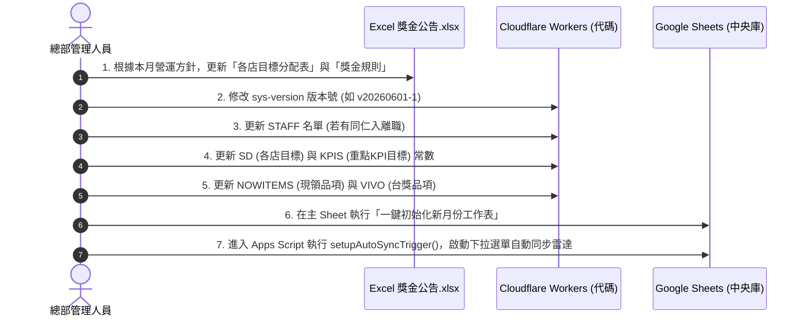
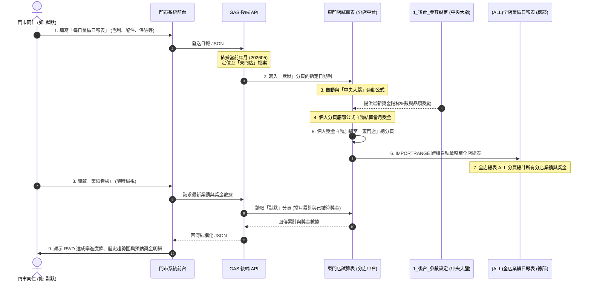

# 門市訂貨管理系統 - 開發設計與規範全紀錄 (2026)

本文件完整整理本階段所有開發紀錄、系統架構設計、核心公式邏輯與系統防呆規則，以利後續開發人員或 AI 協作者快速接軌討論。

---

## 📁 1. 專案基礎與架構總覽

* **前端架構**：React (Vite) + Tailwind CSS + Lucide Icons + Font Outfit/Inter。
* **後端與資料庫**：Google Apps Script (GAS) Web App，以 Google Sheets 作為資料庫儲存。
* **工作表網址**：`https://docs.google.com/spreadsheets/d/186q0vSOMCtPtNSK16LiVl0OlevmOkdAmGEC4YRz4jNs/edit`
* **目前遠端倉庫**：`https://github.com/daliphone/store-management-system` (工作分支: `main`)

---

## 🧮 2. 2026年最新電商平台計算器公式規範

此計算器模組已完全實作於 [OrderForm.jsx](src/components/OrderForm.jsx)，並通過蝦皮商城實收帳單驗證。

### A. 四大平台方案計算公式

1. **🛍️ 蝦商 長期免運 2% + 5% 回饋 (Mall)**
   * **成交手續費**：`賣價 * 類別商城費率` (依商品品類不同)
   * **金流費**：`賣價 * 2.5%`
   * **活動服務費**：`賣價 * 1.5% (蝦幣回饋服務費)` + `NT$60 (免運服務費固定費)`
   * **實拿金額 (單價)**：`賣價 - 成交手續費 - 金流費 - 活動服務費`

2. **🚚 蝦皮直送 (Direct)**
   * **成交手續費**：`賣價 * 類別直送費率` (通常介於 5.5% ~ 12% 之間)
   * **金流費**：`NT$0` (免收)
   * **活動服務費**：`NT$0` (免收)
   * **直送後毛手續費**：`賣價 * 2%` (額外加扣)
   * **實拿金額 (單價)**：`賣價 - 成交手續費 - 直送後毛手續費`

3. **🎟️ 蝦拍 10倍館 (綁免運 2% + 10% 回饋)**
   * **成交手續費**：`賣價 * 類別一般費率`（上限 NT$35,000）
   * **金流費**：`賣價 * 2.5%`
   * **活動服務費**：`賣價 * 2.5% (蝦幣回饋服務費，原3.0%，因同參免運享0.5%專案折扣)` + `NT$60 (免運服務費固定費)` + `NT$10 (物流隱碼服務費)`
   * **實拿金額 (單價)**：`賣價 - 成交手續費 - 金流費 - 活動服務費`

4. **🎟️ 蝦拍 5倍館 (綁免運 1% + 5% 回饋)**
   * **成交手續費**：`賣價 * 類別一般費率`（上限 NT$35,000）
   * **金流費**：`賣價 * 2.5%`
   * **活動服務費**：`賣價 * 1.5% (蝦幣回饋服務費)` + `賣價 * 6.0% (免運服務費方案一)` + `NT$10 (物流隱碼服務費)`
   * **實拿金額 (單價)**：`賣價 - 成交手續費 - 金流費 - 活動服務費`

### B. 特殊加收費率與防呆邏輯
* **物流隱碼服務費 (NT$10)**：僅限拍賣方案（蝦拍10倍館、蝦拍5倍館）加收；蝦商 (Mall) 與 蝦皮直送 (Direct) **免收**（介面置灰防呆且不予計算）。
* **預購訂單 / 較長備貨**：勾選時，成交手續費率額外加收 **`+3.0%`**。
* **促銷檔期日**：
  * 當勾選時，若為商城則成交手續費率 **`+3.0%`**，若為一般賣家則 **`+2.0%`**。
  * **互斥防呆機制**：若平台方案已包含「蝦幣回饋」（Mall、10倍館、5倍館），依蝦皮最新規範，**免收促銷檔期加收手續費**。系統會自動判定免收並將該選項置灰。

### C. 31 筆核心品類費率表 (對齊 2026 最新官方公告)

| 品類代碼 | 品類名稱 | 一般費率 (Auction) | 商城費率 (Mall) | 直送費率 (Direct) |
| :--- | :--- | :--- | :--- | :--- |
| `phone` | 📱 手機 | 5.5% | 3.8% | 5.5% |
| `tablet` | 📟 平板電腦 | 5.5% | 4.0% | 6.5% |
| `wearable` | ⌚ 穿戴裝置 | 5.5% | 4.5% | 6.5% |
| `earphone` | 🎧 耳機/耳麥/藍牙耳機 | 5.5% | 6.5% | 10.0% / 12.0% |
| `audio_amp` | 🎛️ 擴大機/混音器 | 4.0% | 6.0% | 12.0% |
| `speaker_audio_player` | 🔊 音響/喇叭/麥克風 | 6.0% | 7.5% | 12.0% |
| `audio_cable_other` | 🔌 視聽線材/轉換器/其他 | 6.0% | 8.0% | 12.0% |
| `camera_lens` | 🔍 相機鏡頭 | 5.0% | 5.0% | - |
| `camera` | 📷 相機 | 6.0% | 6.0% | - |
| `drone` | 🛸 空拍機 | 6.0% | 6.5% | - |
| `camera_acc` | 🎒 相機周邊配件 | 6.0% | 7.5% | - |
| `camera_security_lens_acc`| 🚨 安全監控/鏡頭空拍周邊 | 6.0% | 8.0% | - |
| `camera_other` | 📦 其他相機周邊 | 6.0% | 8.5% | - |
| `laptop` | 💻 筆記型電腦 | 5.0% | 4.0% | 6.5% |
| `desktop` | 🖥️ 桌上型電腦 | 5.5% | 5.0% | - |
| `monitor_storage` | 🖥️ 螢幕顯示器/儲存裝置 | 5.5% | 5.5% | - |
| `computer_component` | 💾 電腦零組件 | 6.0% | 6.5% | - |
| `keyboard_mouse` | ⌨️ 鍵盤/滑鼠 | 6.0% | 7.0% | - |
| `computer_acc_network` | 🔌 電腦周邊/網路與線材 | 6.0% | 7.5% | - |
| `software_printer_scanner`| 💿 軟體/印表機/掃描機 | 6.0% | 8.0% | - |
| `pc_other` | 📁 其他電腦周邊 | 6.0% | 8.7% | - |
| `large_appliances` | 📺 大型家電 | 5.3% | 5.8% | - |
| `life_appliances` | 🍳 生活/廚房/電視家電 | 5.5% | 6.0% | 7.5% |
| `home_parts` | 🔋 家用零件/電池/遙控器 | 6.0% | 8.0% | - |
| `projector_other_appliances`| 📹 投影機與周邊/其他家電 | 7.5% | 8.5% | - |
| `walkie_talkie` | 📟 對講機 | 6.5% | 9.5% | - |
| `phone_acc_other` | 🔌 手機周邊配件/其他 | 7.5% | 9.5% | 12.0% |
| `game_console` | 🎮 電玩主機 | 5.5% | 3.5% | 5.5% |
| `game_software` | 💿 主機遊戲 | 5.5% | 6.5% | 7.5% |
| `game_acc` | 🕹️ 主機周邊 | 6.0% | 7.5% | 7.5% |
| `healthcare_beauty` | 🥗 保健食品/醫療/美妝保養| 6.0% | 9.0% | - |

---

## 📊 3. Google Sheets 資料庫欄位防錯架構

為了防範欄位移位與公式錯亂，後端資料庫結構經過精心規劃：

### A. `Orders` 訂單總表
* **欄位移位風險防範**：將「訂單平台」指定寫入**第 19 欄 (S 欄)**。
* **原因**：前端系統會自動計算 Q 欄（簽名圖片）與 R 欄（備註）。如果將「訂單平台」強行安插在中間欄位，會導致 Google Sheets 原本設定的公式、條件格式化及欄寬等設定完全移位。寫入 S 欄是最安全且修改量最小的作法。

### B. `ECommerceRates` 雲端費率表 (NEW)
* **目的**：實現「費率參數化」，方便未來無須修改前端 React 程式碼即可在雲端調整手續費率。
* **欄位對照**：
  1. `platform` (平台代碼, 如 mall, direct)
  2. `category` (品類代碼, 如 phone, game_console)
  3. `categoryName` (前台顯示名稱)
  4. `commissionRate` (成交費率)
  5. `transactionRate` (金流費率)
  6. `coinRate` (蝦幣費率)
  7. `shippingRate` (免運費率)
  8. `flatFee` (活動固定費)
  9. `backProfitRate` (後毛費率)
  10. `hasCap` (是否設手續費上限)
  11. `promoRate` (促銷檔期加收費率)

### C. `ECommerceDetails` 電商扣費明細表 (NEW)
* **目的**：獨立記錄每筆電商訂單經計算器算出的完整扣費明細，便於帳務核對。
* **欄位結構**：
  - `id` (與 `Orders` 訂單編號關聯)
  - `platform` (訂單平台)
  - `category` (商品品類)
  - `price` (賣價)
  - `cost` (成本)
  - `commissionFee` (成交手續費)
  - `transactionFee` (金流與系統處理費)
  - `cryptoFee` (物流隱碼服務費)
  - `shippingCampaignFee` (免運專案費)
  - `coinCampaignFee` (蝦幣回饋專案費)
  - `backProfitFee` (直送後毛)
  - `totalFees` (手續費總計)
  - `payout` (實拿金額)
  - `profit` (預估毛利)
  - `profitMargin` (毛利率)
  - `createdAt` (寫入時間)

---

## 💬 4. LINE 官方帳號定時推播設計

本功能透過超級管理員前端介面與 GAS 後端排程器緊密結合：

### A. 推播設定儲存 (於 `Config` 工作表)
* `line_channel_access_token`：LINE 官方帳號 Token。
* `line_group_id`：接收提醒之 LINE 群組 ID。
* `line_reminder_time`：定時推播時間 (HH:MM)。

### B. 自動化排程機制 (Trigger Auto-Update)
* **運作原理**：當管理員在設定頁面修改「定時推播時間」並儲存時，前端發送 `saveLineTrigger` 請求，GAS 會**自動刪除舊的同名 Daily Trigger，並根據新設定的時間自動建立新的 Trigger**，完全不需要手動進入 Apps Script 後端設定。

### C. 推播內容統計模組
推播訊息會由 GAS 解析當前 Sheets 數據，產生結構化、分門別類的訊息，內容包含：
1. 🚨 **逾期未完成調貨**：統計逾期天數大於 0 且狀態非已到貨、退換貨的調貨單，列出品項與對應分店。
2. 📅 **今日預計交貨**：篩選承諾日期為今天的調貨與電商訂單。
3. 📦 **已到貨待驗機交單**：統計已到貨但未交單的訂單。
4. 📋 **今日待辦日常店務**：篩選電商部本日尚未完成的日常店務清單。

---

## 🔒 5. 近期新增之系統防呆與智慧互動規範

### A. 計算器權限限縮
* **規則**：一般門市人員建單時隱藏手續費計算器。
* **限制條件**：`platform === '電商部' || currentUser.role === 'SUPER_ADMIN'` 才能看見並開啟「平台計算器」。

### B. 訂單平台與計算器之雙向智慧聯動
* **正向聯動**：在單筆建單介面選擇「蝦商 長期免運」等外部電商平台時，點擊平台計算器會**自動預選**對應的平台方案與品類。
* **反向聯動**：在計算器內點選「代入實拿金額至單價」時，除了帶入單價與成本外，也會將訂單的「訂單平台」**反向同步**為所選的蝦皮方案。

### C. ⚠️ 電商訂單真實平台編號防呆機制
為了確保電商人員不會遺漏將隨機生成的訂單 ID 改為真實平台單號，實作了以下防錯：
1. **切換自動清空**：當訂單平台由門市切換至蝦皮平台時，若編號仍為系統隨機產生的 `ord_` 開頭編號，系統會**自動將其清空**，並動態將 placeholder 改為 `請輸入平台真實訂單編號 (必填)`，促使同仁手動輸入。
2. **切換自動補回**：若切換回門市或其他，若編號為空，則重新生成隨機 `ord_xxxxxxxx` 編號。
3. **強制提單校驗 (強防呆)**：在單筆送出時，若平台為外部電商平台，系統會檢查：
   - 訂單編號是否為空。
   - 訂單編號是否仍以 `ord_` 開頭。
   - 以上任一條件成立即**強行阻擋送出**，並彈出 `alert` 提示要求填寫真實單號。

### D. ⚡ 網拍電商批量匯入「智能文字解析器」規則
1. **🔵/🟠/🔴 符號智能判定與分流**：
   * **🔵 (可從東門調)**：類型解析為 `調貨`，狀態預設為 `已下訂`，備註記為 `[調貨庫存] 可從東門調` 或指定的庫存來源（如：網拍: 4）。
   * **🟠 (分店調看看)**：類型解析為 `調貨`，狀態預設為 `訂貨需求`，備註記為 `[調貨庫存] 分店調看看`。為防止多店庫存（如 `永康1/五甲2/安中1`）被截斷，解析器會智能判定格式，完整保留所有調貨分店與數量的備註資訊。
   * **🔴 (缺貨無庫存)**：自動判定為 `訂貨需求`，並將訂單類型調整為 **`訂貨`**（而非調貨），以利採購人員識別為向廠商訂貨之品項。
2. **📅 智慧到期日 (Promise Date) 解析與帶入**：
   * 當文字中包含到期日資訊（例如：`5/29到期-實拿1064`），解析器會自動匹配並提取月份與日期，將該筆訂單的「承諾交期」自動帶入為當年度對應日期（例如 `2026-05-29`）。
   * **批次子品項公共備註與到期日套用**：在多規格子品項的情境中（如主品項 `A16` 下方有 `銀*3`、`藍*1`，後接 `5/29到期-實拿12801~13011`），解析器會自動在 subitems 迴圈結束後提取非規格的公共資訊，將到期日（如 `5/29`）與實拿備註，全數套用並回填至該批次所有的子品項中，徹底解決舊版解析器直接跳過且遺漏該行資訊的 Bug。

---

## 🔒 6. 客戶關係維護 (CRM) 隱私與業績防搶單權限隔離設計

在具備個人業績提成制度的門市與銷售環境中，為了解決同仁「既想藏私保護自己客戶，又需要避免重複建檔」的矛盾，規劃以下 CRM 權限與資料保護設計：

### A. 資訊分級防護與去敏感化
1. **基本資訊 (全局共用與防重建模組)**：
   - **共享範圍**：所有銷售同仁均可透過關鍵字（姓名、去敏感化電話）搜尋現有客戶。
   - **去敏感處理**：若該客戶非自己建立且非主管職，**自動遮蔽電話中間四碼** (例如 `0912-***-567`)，且不顯示詳細 LINE ID 或地址。這能在「防止重複建檔」與「保護客戶隱私」之間取得平衡。
2. **核心情資隔離**：
   - 客戶的「詳細跟進備註」、「預售意向方案」、「購買偏好」等高度機密資料，預設**僅限該客戶建立者 (Creator) 及主管/店長級別**可查看與編輯。其他一般同仁無權檢視。

### B. 客戶保護期與業績防搶機制
1. **動態保護期**：
   - 系統為每位客戶設定「保護時間窗口」（例如：自最後一次成功更新跟進備註或建立訂單起 30 天內）。
   - 在保護期內，該客戶標示為「專屬跟進中」，其他同仁無法直接對該客戶發起新的訂單或修改其資料。若該客戶在保護期內主動前來成交，業績與提成預設歸屬於原建立者。
2. **公海退回與接管機制 (公海池)**：
   - 若客戶超過 30 天無任何同仁跟進，系統會將該客戶**自動釋放至公海池**。
   - 進入公海池後，任何同仁皆可申請「接管」此客戶，接管成功後重新計算 30 天保護期。

### C. 稽核軌跡與操作日誌 (Audit Log)
* **防弊機制**：系統後端必須詳實記錄「誰在何時查看了非自己客戶的敏感資訊」、「誰匯出了客戶資料」以及「誰從公海接管了客戶」。
* **異常警示**：若有單一帳號在短時間內大量查詢非自己客戶的去敏感資訊，系統將自動通知店長或管理員，防止同仁惡意抄錄與外洩客戶名單。

---

## 🚀 7. 開發與部署常用指令指引

### A. 前端 React (Vite)
* **本地開發**：`npm run dev`
* **打包編譯**：`npm run build` (編譯出的 bundle 位於 `/dist` 資料夾中)
* **Git 提交與推送**：
  ```bash
  git add .
  git commit -m "feat: 提交功能描述"
  git push origin main
  ```

### B. 後端 Google Apps Script
1. 複製 `google-apps-script.js` 檔案中的完整程式碼。
2. 進入 Google Sheets 試算表，點選 **擴充功能 > Apps Script**。
3. 將代碼貼上覆蓋，點選儲存。
4. 點選 **部署 > 新增部署**，選取 **網頁應用程式**：
   - 專案說明：填寫版本說明 (例如 2026-V3-OrderPlatform-Fix)。
   - 執行身份：選取 **我**。
   - 存取權限：選取 **任何人** (Anyone)。
5. 點選部署並授權（若有警告，點選 Advanced -> Go to ... (unsafe) -> Allow）。
6. 將產生的 **網頁應用程式網址 (Web App URL)** 複製，填入系統設定中。
7. **關鍵步驟**：部署完成後，請務必點選試算表功能表上的 **「馬尼門市系統」 > 「一鍵初始化系統工作表」**。這會自動建立並安全格式化所有新工作表欄位。

---

## 📊 8. 門市業績與獎金系統 - 保留開發與完整紀錄 (2026年5月)

本章節完整記錄針對「門市業績日報表」與「Cloudflare Workers 獎金公告系統」的數據關聯性、運作機制、換月流程，以及未來的系統重構整合路徑。目前此項目依指示列為「保留開發」狀態。

### A. 系統全局關聯圖 (System Architecture & Data Flows)

本系統是由 **Cloudflare Workers (行動回報前端)**、**Google Sheets & Apps Script (中台運算與中央參數庫)**、以及 **Excel 實體公告 (業務指標來源)** 共同交織而成的架構：

```mermaid
flowchart TD
    subgraph Excel ["實體業務輸入 (Excel)"]
        EX[5月獎金公告.xlsx]
        EX_T[各店目標分配表]
        EX_R[獎金%數與團績規則]
    end

    subgraph Workers ["行動回報前台 (Cloudflare Workers)"]
        W_URL["https://mani-bonus.a0982585084.workers.dev/"]
        W_SD["各店目標常數 (SD)"]
        W_KPIS["加權 KPI 目標 (KPIS)"]
        W_NOW["現賣現領清單 (NOWITEMS)"]
        W_VIVO["VIVO台獎成本/售價 (VIVO)"]
    end

    subgraph Sheets ["系統大腦與中台 (Google Sheets)"]
        T1["Tier 1: 1_後台_參數設定<br>(中央參數控制腦)"]
        T2["Tier 2: 各店業績日報表<br>(分店試算表與個人Tab)"]
        T3["Tier 3: 3_前台_個人儀表板<br>(店內前台大字體呈現)"]
    end

    subgraph BackEnd ["總部/中台 API (GAS)"]
        GAS_API["Google Apps Script Web App<br>(APPS_SCRIPT_URL)"]
    end

    %% 關聯線
    EX_T -->|手動移植更新常數| W_SD
    EX_T -->|手動移植更新常數| W_KPIS
    EX_R -->|公式參照/規則設計| T1
    
    W_URL -->|1. GET: action=getPersonData| GAS_API
    W_URL -->|2. POST: action=submit (含 detailJson)| GAS_API
    GAS_API -->|寫入/讀取數據| T2
    
    T1 -->|命名範圍連動 / 規則派發| T2
    T2 -->|INDIRECT 跨分頁安全加總| T3
    
    classDef excel fill:#fcf8e3,stroke:#8a6d3b,stroke-width:1px;
    classDef workers fill:#d9edf7,stroke:#31708f,stroke-width:1px;
    classDef sheets fill:#dff0d8,stroke:#3c763d,stroke-width:1px;
    classDef backend fill:#f5f5f5,stroke:#333,stroke-width:1px;
    class Excel,EX,EX_T,EX_R excel;
    class Workers,W_URL,W_SD,W_KPIS,W_NOW,W_VIVO workers;
    class Sheets,T1,T2,T3 sheets;
    class BackEnd,GAS_API backend;
```

---

### B. 核心關聯點與運作機制解析

1. **實體 Excel 公告 ➔ Workers 程式碼常數對照**：
   * **各店目標分配 (SD)**：對照 Excel 中「各店目標分配表」的掛績人數與各成數門檻，Workers 代碼的 `SD` 常數定義了各店等級（`g`）、掛績人數（`p`）、高標（`tgt`）與 `t7`/`t8`/`t9` 門檻。
   * **加權 KPI 目標 (KPIS)**：對照 Excel 中的「本月重點目標」，定義 Google 評論、社群會員、LiTV 等加權比重與門檻。
   * **現領與 VIVO 台獎 (NOWITEMS / VIVO)**：對照 Excel 內特約機型售價與利潤，提供 Workers 前端計算「當日現領」與「累計台獎」。

2. **Workers 前端 ➔ GAS API ➔ Google Sheets 寫入鏈路**：
   * **前台回填 (GET)**：人員選定分店與姓名時，Workers 向 GAS API 發送 `action=getPersonData`，自動抓取當月最新一筆回報資料以方便修正。
   * **資料寫入 (POST)**：送出時發送 `action=submit`，將主要毛利與獎金寫入 Sheets，並將複雜細項（如 vivo 手機、中嘉寬頻細節）打包成 `detailJson` 寫入 Sheets 備份，避免試算表欄位膨脹。

3. **三層式 Sheets 運算 ➔ 前台個人動態儀表板**：
   * **Tier 1 (參數控制後台)**：定義階梯抽成%數與規則。
   * **Tier 2 (分店業績中台)**：同仁填寫的日報表儲存處。
   * **Tier 3 (前台個人儀表板)**：使用 `getEmployeeSheetNames()` 動態雷達掃描所有員工分頁，並以 `=SUM(INDIRECT("'" & $C$4 & "'!座標"))` 實現跨 Tab 安全加總，物理隔離其他人隱私且防止公式錯誤。

---

### C. 獎金公告換月切換標準作業流程 (SOP)

當月份交替時，管理人員請依以下流程進行更新：



1. **更新 Workers 程式常數**：在 Cloudflare 中編輯 Worker，更動 `sys-version` 版號、`STAFF` 陣列，並手動填入新月的 `SD`、`KPIS`、`NOWITEMS` 與 `VIVO` 對照常數後儲存部署。
2. **初始化 Sheets 中台**：在中央試算表執行 GAS 腳本初始化新月份分頁，並執行 `setupAutoSyncTrigger` 函數，安裝背景名單雷達。

---

### D. 未來整合重構走向建議 (Roadmap)

我們建議的終極整合走向是：**「一次輸入（日報），公式全自動計算，由下而上鏈結彙總，前台純讀取呈現」**。



#### 三階段走向計畫：
* **階段一：底層日報動態定位與直寫（已完成）**：實現前台登錄 ➔ GAS ➔ 分店 Sheets 個人分頁的 Read-Modify-Write 安全覆寫。
* **階段二：公式大腦與獎金自動結算連動（下一階段核心）**：
  1. 在總部雲端建立 `1_後台_參數設定` 工作表，定義階梯抽成等常數。
  2. 在個人分頁佈署連動參數庫的 VLOOKUP/XLOOKUP 結算公式，由日報累積數據直接算出獎金。
  3. 重構 GAS 業績看板 API，直接讀取個人分頁底部的結算獎金，正式將 Workers 表單除役。
* **階段三：獎金系統完全整合（終極目標）**：系統新增「月底獎金審核與核發」，生成薪資與獎金明細單 PDF，並於 Dashboard 新增「本月已累積獎金」卡片，以遊戲化激勵同仁。

---

### E. 0528files 獎金公告系統與常數規則深度解析 (2026年5月28日版本)

> [!IMPORTANT]
> **開發狀態說明（2026年5月29日更新）**：
> 經與業主討論，**獎金公告的 API 串接與 UI 面板開發先予保留（暫不進行實作與部署）**。
> 目前已將完整常數規則、公式演算法與設定檔之分析結果完整記錄於本紀錄中。後續若重新啟動此功能開發，可直接以此存檔邏輯進行實作。

根據對 `C:\Users\serap\Downloads\獎金公告\0528files` 下的 V10 Apps Script 原始碼、設定檔 `馬尼獎金設定表_v4.xlsx` 的深度分析，特將其核算常數與規則完整歸檔，以供後續重新啟動開發時 100% 邏輯對接：

#### 1. 系統後台配置與資料定位 (SHEET_RAW 欄位對照)
原 Apps Script V10 後台對接的是獨立的「馬尼獎金系統 2026」工作簿。回報追加（`appendRow`）具有 55 個定位欄位（0-based）：
* `COL.GROSS` [5]：當月個人毛利，`COL.GROSS_TGT` [6]：個人毛利目標。
* `COL.INS_CNT` [9]：保險件數，`COL.INS_REV` [10]：保險營收，`COL.INS_BONUS` [11]：個人保險獎金。
* `COL.TOTAL` [39]：個人獎金合計，`COL.NOW` [40]：現賣現領合計，`COL.VIVO` [41]：VIVO台獎合計，`COL.HUAWEI` [43]：華為總點數。
* `COL.KPI1` ~ `COL.KPI9` [44~52]：分別對應 9 項重點 KPI 當月達成實績。
* `COL.DETAIL_JSON` [54]：打包儲存的細項回填 JSON 資料。

#### 2. 個人獎金 (Personal Bonus) 核心算法
* **A. 毛利獎金 (G32 = gross * pct * mul)**：
  - **個人毛利%數 (pct)**：達 10 萬/12 萬/16 萬/20 萬/25 萬分別抽成 `3% / 6% / 8% / 10% / 12%`。未達 10 萬（若掛績 6 個月內為未達 7 萬）則獎金為 0（J10 防呆）。
  - **團績加乘倍數 (mul)**：個人毛利需達 **12 萬**，團績加乘才會啟動。團體完成率（實際/目標）：
    * `>= 100%`：**1.6 倍**
    * `>= 90%`：**1.4 倍**
    * `>= 80%`：**1.2 倍**
    * `>= 70%`：**1.1 倍**
    * `< 70%` 且 `>= 60%`：**0.8 倍**
    * `< 60%`：**0.5 倍**
  - **⭐ 15 萬個人保障**：若個人毛利達 **15 萬** 以上，團績加成強制保障為 **1.0 倍**（不受團績差的打折懲罰）。
  - **保障下限**：若個人毛利在 10 萬 ~ 11.99 萬之間，團績達 70% 以上時加乘為 **1.0 倍**。
* **B. 保險獎金**：個人保費總額 × **3%**。
* **C. 門號獎金 (cRates 對照)**：
  - 遠傳 NP 599以上：$100/門
  - 遠傳續約奕丞 5G（599/799/1199以上）：$50 / $200 / $500 /門
  - 中華 NP 599以上：$50/門
  - 台哥大 NP 599以上：$100/門
  - 台哥大續約金三角（799-999 / 1199以上）：$200 / $400 /門
* **D. 配件獎金**：橙艾貼 $50/件、simmpo 貼 $100/件、WIWU 貼 $50/件。
* **E. 中嘉寬頻獎金**：台南/高雄專案（網路+電視 / 單網路 / Sound Box）：$500 / $200 / $500 /件。
* **F. iPhone 組合獎金**：個人當月 iPhone 銷量需 **>= 5 台**。獎金為組合商品（iPad + Watch + 華為 GT 手錶）總件數 × **$200**。

#### 3. 👥 團體獎金 (Team Bonus) 均分算法
* **資格限制**：個人當月毛利需達門檻（正常 10 萬，掛績 6 個月內 7 萬）始有資格均分。
* **毛利團體獎金 (gp / hc)**：依店級達成率派發全額獎金（gp），由合格人數（hc）均分：
  - `達成率 >= 100%`：A級店發 **$20,000**，B級店 **$10,000**，C級店 **$8,000**。
  - `達成率 >= 90%`：A級店發 **$10,000**，B級店 **$7,500**，C級店 **$6,000**。
  - `達成率 >= 80%`：A級店發 **$5,000**，B級店 **$2,000**，C級店 **$4,000**。
* **保險團體獎金**：全店實際保費達 5萬 / 7.5萬 / 10萬，店獎金派發 $1,000 / $1,500 / $2,000。個人保險需 **>= 1 件** 始有均分資格。
* **團隊領取（由店長支配基金）**：
  - 遠傳 NP（資費 >= 799）達 6 門起，每門發 **$100** (基本獎金 $600)。
  - 遠傳續約（奕丞，資費 >= 799）達 8 門起，每門發 **$100** (基本獎金 $800)。

#### 4. 🎯 9項重點 KPI 加權目標 (KPIS)
* 各項目標：Google評論（17）、社群會員（17）、LITV（17）、庫存手機（15）、蘋果系列（3）、VIVO銷售（8）、華為點數（10）、橙艾玻貼（6）、吸塵器（2）。
* 權重佔比：VIVO 與華為各佔 **15%** 加權，其餘 7 項各佔 **10%**。

#### 5. ⚡ 現賣現領與 VIVO 台獎
* **現賣現領**：手機（如 MOTO Pad $300、紅米15C $50）、穿戴（如華為GT5 $300、GARMIN $200）、家電（如 GP吸塵器 $400、冷熱筋膜槍 $100），當天下班即可領取。
* **VIVO 台獎**：指定機型銷售（如 Y29S $50、V60 512G $100、V70 $300、X300PRO $300）。5月銷售，7月會議發放。

#### 6. 戰情室角色密碼 (AUTH_STORE & STORE_KEYS)
* **總公司（全店視野）**：`?key=701029`
* **各分店店長（鎖定分店）**：永康 (`yk2026`)、文賢 (`wx2026`)、東門 (`dm2026`)、歸仁 (`gr2026`)、小西門 (`xxm2026`)、安中 (`az2026`)、鹽行 (`yh2026`)。

